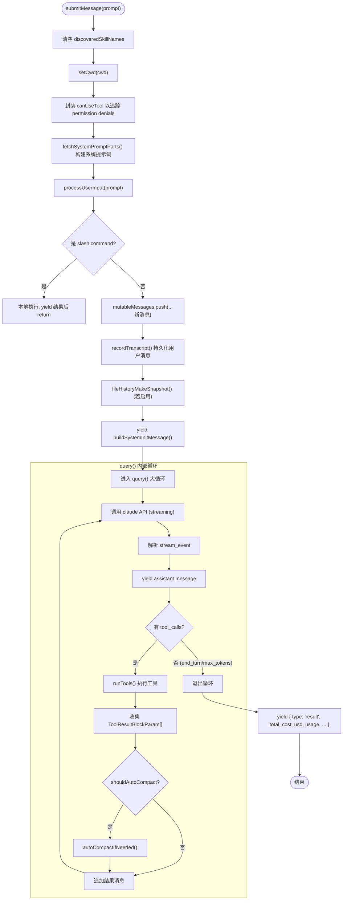

# 01 - QueryEngine 主循环引擎

> 源码位置: `src/QueryEngine.ts` (1296行, 46KB) + `src/query.ts` (1730行, 68KB)

QueryEngine 是原版 Claude Code 的**对话生命周期管理器**和**核心决策循环引擎**。它拥有整个对话的 session 状态（消息、文件缓存、用量统计、权限追踪），每次 `submitMessage()` 调用代表一个新 turn，状态跨 turn 持久化。

---

## 1. 数据流图

```mermaid
graph TD
    SDK["SDK / REPL 调用者"] -- "prompt (string | ContentBlockParam[])" --> QE["QueryEngine.submitMessage()"]

    subgraph QueryEngine 内部
        QE --> PUI["processUserInput() 解析用户输入"]
        PUI -- "slash command" --> SlashExec["本地指令执行 (不进入 query)"]
        PUI -- "普通对话" --> MsgPush["push 新消息至 mutableMessages"]
        MsgPush --> Transcript1["recordTranscript() 持久化"]
        Transcript1 --> QueryLoop["进入 query() 异步生成器大循环"]
    end

    subgraph query() 主循环 (query.ts)
        QueryLoop --> Claude["调用 Anthropic/OpenAI API (claude.ts)"]
        Claude -- "stream_event" --> StreamParse["解析流式事件 (message_start/delta/stop)"]
        StreamParse -- "assistant msg" --> ToolCheck{"有 tool_use block?"}
        ToolCheck -- "是" --> RunTools["runTools() 并发/串行执行工具"]
        RunTools --> ToolResult["收集 ToolResultBlockParam"]
        ToolResult --> AutoCompact{"shouldAutoCompact?"}
        AutoCompact -- "是" --> Compact["compactConversation() 压缩"]
        AutoCompact -- "否" --> NextTurn["追加消息, 继续下一轮"]
        Compact --> NextTurn
        NextTurn --> Claude
        ToolCheck -- "否 (end_turn)" --> Yield["yield 最终 result message"]
    end

    Yield --> SDK
```

---

## 2. 入口与出口函数

### 2.1 入口: `QueryEngine.constructor(config)`

```typescript
// 文件: src/QueryEngine.ts:200
constructor(config: QueryEngineConfig)
```

**QueryEngineConfig 关键字段:**

| 字段 | 类型 | 说明 |
|------|------|------|
| `cwd` | `string` | 工作目录 |
| `tools` | `Tools` (readonly Tool[]) | 可用工具集合 |
| `commands` | `Command[]` | 斜杠指令集 |
| `mcpClients` | `MCPServerConnection[]` | 活跃 MCP 连接 |
| `canUseTool` | `CanUseToolFn` | 权限检查回调 |
| `getAppState` / `setAppState` | 函数 | 全局状态读写 |
| `maxTurns` | `number?` | 最大轮次限制 |
| `maxBudgetUsd` | `number?` | 美元费用上限 |
| `thinkingConfig` | `ThinkingConfig?` | 思维链配置 (adaptive/disabled) |

### 2.2 核心入口: `submitMessage()`

```typescript
// 文件: src/QueryEngine.ts:209
async *submitMessage(
  prompt: string | ContentBlockParam[],
  options?: { uuid?: string; isMeta?: boolean }
): AsyncGenerator<SDKMessage, void, unknown>
```

- **输入**: 用户文本或多模态内容块数组
- **输出**: 异步生成器，yield 多种 `SDKMessage` 类型：
  - `system` (init / compact_boundary)
  - `assistant` (模型回复)
  - `user` (replay 回显)
  - `result` (最终结果，含 cost / usage / duration)

### 2.3 出口: query() 异步生成器

```typescript
// 文件: src/query.ts:150 (大约位置)
export async function* query(params: {
  messages: Message[]
  systemPrompt: SystemPrompt
  userContext: Record<string, string>
  systemContext: Record<string, string>
  canUseTool: CanUseToolFn
  toolUseContext: ToolUseContext
  maxTurns?: number
  taskBudget?: { total: number }
  // ...
}): AsyncGenerator<Message, void, unknown>
```

---

## 3. 结构流程图



---

## 4. 核心设计原理

### 4.1 AsyncGenerator 流式架构
QueryEngine 的 `submitMessage` 和底层的 `query` 均使用 TypeScript 的 `async function*` 异步生成器模式。这意味着：
- **调用者通过 `for await ... of` 逐条消费**消息，天然支持背压（backpressure）。
- 流式事件（`stream_event`）在 API 响应的每个 content block 到达时就被 yield，实现了真正的实时流式 UI。
- 在 SDK 模式下，每条 yield 的消息都可能触发 `recordTranscript()` 持久化，保证即使进程被 kill 也能 `--resume` 恢复。

### 4.2 工具执行与并发安全
原版使用 `StreamingToolExecutor`（位于 `src/services/tools/StreamingToolExecutor.ts`）来编排工具执行：
- 通过 `tool.isConcurrencySafe(input)` 判断某工具是否允许并发。若是（如 `GrepTool`、`GlobTool`），多个工具调用可以 `Promise.all` 并行执行。
- 非并发安全的工具（如 `BashTool`、`FileEditTool`）则串行排队。
- 工具执行结果大小受 `tool.maxResultSizeChars` 约束，超限则写入磁盘并返回摘要 + 文件路径。

### 4.3 自动压缩触发 (AutoCompact)
在每轮工具执行后，`query.ts` 检查 `shouldAutoCompact()`：
- 使用 `tokenCountWithEstimation(messages)` 计算当前 token 数。
- 阈值 = `getEffectiveContextWindowSize(model) - 13,000`（AUTOCOMPACT_BUFFER_TOKENS）。
- 设有**断路器**：连续失败 3 次后停止重试（`MAX_CONSECUTIVE_AUTOCOMPACT_FAILURES = 3`）。
- 压缩成功后调用 `runPostCompactCleanup()` 清理缓存状态。
