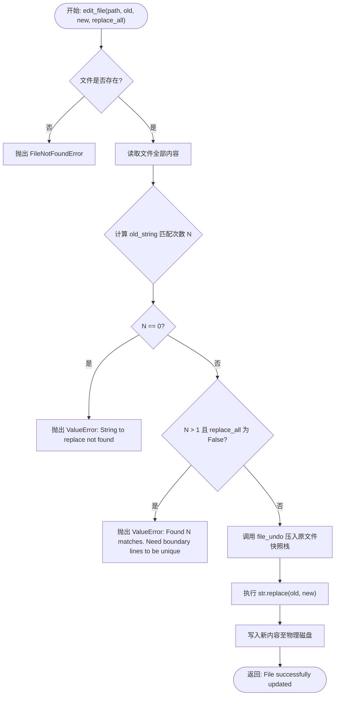

# 01 - 工作区开发工具链模块

工作区开发工具链模块是重构版 Claude Code（`claude-py`）与本地物理文件系统及 Shell 运行环境进行安全、高效交互的底层桥梁。该模块提供高度可靠的代码检索、读取、写入、精细化编辑以及 shell 命令并发运行等能力，具有防灾和状态感知设计。

---

## 1. 数据流图 (Data Flow Diagram)

展现大模型（LLM）通过 LangGraph 引擎分发工具调用，并获取底层物理系统响应的数据流向：

```mermaid
graph TD
    LLM["大模型 (LLM)"] -- "1. 生成 ToolCalls (JSON)" --> Agent["LangGraph Agent 引擎"]
    Agent -- "2. 解析参数并分发" --> Tools["工具分发层 (TOOLS_BY_NAME)"]
    
    subgraph 工具层 (claude_code/tools/)
        Tools -- "参数: command, cwd" --> Bash["bash.py (execute_bash)"]
        Tools -- "参数: path, range" --> Read["file_read.py (read_file)"]
        Tools -- "参数: path, content" --> Write["file_write.py (write_file)"]
        Tools -- "参数: path, old, new" --> Edit["file_edit.py (edit_file)"]
        Tools -- "参数: query, pattern" --> Search["search.py (grep & glob)"]
    end

    subgraph 物理物理系统 / 进程
        Bash --> Shell["本地 Shell / Popen / TaskManager"]
        Read --> DiskR["物理文件 (读) / ipynb 解析"]
        Write --> DiskW["物理文件 (写)"]
        Edit --> DiskE["物理文件 (修改)"]
        Search --> Index["物理目录检索"]
    end

    Shell -- "返回 stdout/stderr/CWD" --> Tools
    DiskR -- "返回 cat -n 格式字符串" --> Tools
    DiskW -- "返回 写入成功状态" --> Tools
    DiskE -- "返回 匹配修改状态" --> Tools
    Index -- "返回 匹配列表" --> Tools

    Tools -- "3. 封装为 ToolMessage" --> Agent
    Agent -- "4. 追加至 Messages 历史" --> LLM
```

---

## 2. 出口与入口函数接口说明 (API Interface)

### 2.1 Bash 命令执行 (`execute_bash`)
*   **入口函数**: `execute_bash(command: str, cwd: str) -> dict`
*   **输入参数**:
    *   `command` (str): 待在 shell 中运行的完整命令行。
    *   `cwd` (str): 命令执行的目标绝对工作路径。
*   **出口返回值**: `dict` 结构：
    *   `stdout` (str): 标准输出。若检测到末尾 `&` 标识，则包含后台启动的任务 ID 提示。
    *   `stderr` (str): 标准错误或超时报错信息。
    *   `exit_code` (int): 退出码（0 表示成功，非 0 表示异常，124 表示超时）。
    *   `new_cwd` (str): 命令执行结束后的最新工作目录。
*   **副作用**:
    *   可能派生后台 `subprocess.Popen` 守护任务。
    *   可能因 `cd` 改变整个会话的主工作路径。

### 2.2 文件分页读取 (`read_file`)
*   **入口函数**: `read_file(file_path: str, start_line: int = None, end_line: int = None) -> str`
*   **输入参数**:
    *   `file_path` (str): 目标文件绝对/相对路径。
    *   `start_line` (int, 可选): 开始读取的行号（1-indexed）。
    *   `end_line` (int, 可选): 结束读取的行号（inclusive）。
*   **出口返回值**: `str`，包含带有行号标记（`1\tline`）的格式化文本。若是 `.ipynb` 文件，则输出解析后的 JSON Cell 结构。
*   **副作用**: 无，只读操作。

### 2.3 文件精确匹配修改 (`edit_file`)
*   **入口函数**: `edit_file(file_path: str, old_string: str, new_string: str, replace_all: bool = False) -> str`
*   **输入参数**:
    *   `file_path` (str): 目标代码文件路径。
    *   `old_string` (str): 待替换的精确原字符串内容（包含前导空格）。
    *   `new_string` (str): 替换后的新内容。
    *   `replace_all` (bool, 默认 False): 若原内容出现多次，是否全部替换。
*   **出口返回值**: `str`，形如 `"File successfully updated."` 的状态提示。
*   **副作用**:
    *   直接修改磁盘文件。
    *   修改前自动将原文件快照压入 `file_undo` 的内存防灾栈中，供一键撤销。

---

## 3. 结构流程图 (Structure Flowchart)

以下是 **文件精细编辑 (`edit_file`)** 及唯一定位约束校验的结构流程图：



---

## 4. 底层技术原理与核心逻辑设计

### 4.1 工作路径状态捕获与同步机制 (`BashTool`)
在无状态或短期子进程会话中，连续执行 `cd` 无法保持目录。重构版采用了 **工作路径动态追踪器** 设计：
- 强行在用户命令后附加拼接特制的路径分隔串联：`({ user_command ; } ; EXIT_CODE=$? ; echo '___CWD_MARKER___' ; pwd ; exit $EXIT_CODE)`
- 即使前序用户命令执行报错（`EXIT_CODE != 0`），`;` 后缀依旧能强制执行并输出 `___CWD_MARKER___` 及真实的工作路径。
- 在工具出口层通过正则和字符串切分，捕获到真实的当前工作目录（CWD），并将其存入全局 `AgentState` 中更新。

### 4.2 后台任务 `&` 智能判定与分发
- 在命令提交给 shell 运行前，对其进行修剪去除首尾空格。
- 若命令以 `&` 结尾，则判定其为耗时后台进程，剥离末尾的 `&` 后，分发至 `TaskManager` 守护线程启动运行，并在出口快速响应，保障了大模型交互的非阻塞流畅度。

### 4.3 `FileEditTool` 唯一定位冲突防护算法
原版 TypeScript 源码中，大模型频繁因为正则或局部的 ad-hoc 替换而把不相干的代码大面积抹除。本重构版设计了严苛的 **唯一性单点匹配机制**：
- 如果大模型提供的 `old_string` 在整个文件中出现了多次（$N > 1$），并且大模型没有显式指定 `replace_all=True`，则工具会立即触发 `ValueError` 报错。
- 此时报错信息中包含匹配次数，以强制倒逼大模型在接下来的 ToolCall 中提供包含前导空格、空行或上下游更多行（Boundary Context）的 `old_string`，以确保匹配精准到唯一的单行。
