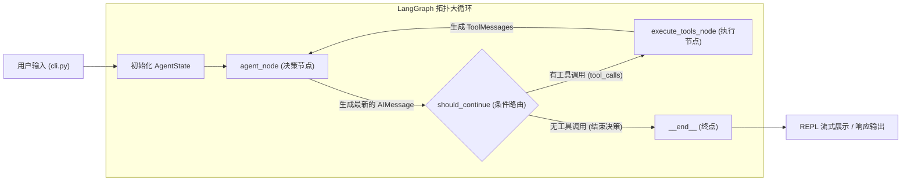
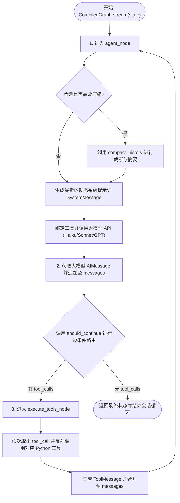

# 02 - Agent主循环与状态图模块

Agent主循环与状态图模块是 `claude-py` 的决策和流转控制中心。通过结合 **LangGraph** 库构建的状态图结构，将大模型（LLM）的智能推理决策、本地开发工具的批量同步执行、对话 Token 越界检测以及条件路由判定完美编排为一个高内聚、支持非阻塞自循环的开发者助手大脑。

---

## 1. 数据流图 (Data Flow Diagram)

展现全局 `AgentState` 伴随节点运转在 LangGraph 拓扑图中的数据传递和转换：

---

## 2. 出口与入口函数接口说明 (API Interface)

### 2.1 状态图编译器 (`create_agent_graph`)
*   **入口函数**: `create_agent_graph() -> StateGraph.compile()`
*   **输入参数**: 无。
*   **出口返回值**: `CompiledGraph`，一个经 LangGraph 编译后的可流式执行的状态图对象。
*   **副作用**: 无，只进行拓扑定义和绑定。

### 2.2 Agent决策节点 (`agent_node`)
*   **入口函数**: `agent_node(state: AgentState) -> dict`
*   **输入参数**:
    *   `state` (AgentState): 当前会话的全局状态。
*   **出口返回值**: `dict`，更新状态的字典：
    *   `messages` (list): 追加了大模型最新生成的 `AIMessage` 的列表。
    *   `summarized_history` (str): 更新后的高密度 Markdown 历史摘要。
*   **副作用**:
    *   在内部会自动调用 `Tiktoken` Token 检测，可能触发**对话垃圾回收与记忆压缩**子系统。
    *   调用 OpenAI / Anthropic 大模型 API，消耗 Token。

### 2.3 工具执行节点 (`execute_tools_node`)
*   **入口函数**: `execute_tools_node(state: AgentState) -> dict`
*   **输入参数**:
    *   `state` (AgentState): 包含待执行工具调用的全局状态。
*   **出口返回值**: `dict`，更新状态的字典：
    *   `messages` (list): 追加了多个执行完毕的 `ToolMessage` 的消息列表。
    *   `current_working_directory` (str): 根据 `execute_bash_tool` 返回结果，动态更新的 CWD 工作路径。
*   **副作用**:
    *   直接触发本地工作空间的读、写、修改或 Shell 进程命令等副作用操作。

---

## 3. 结构流程图 (Structure Flowchart)

展现整个 Agent 环流引擎的自控制时序流：

---

## 4. 底层技术原理与核心逻辑设计

### 4.1 LangGraph 状态路由跳转设计
在标准的 LangGraph 中，通常使用 `merge_messages` 默认 Reducer，但这会导致对话消息“只增不减”，严重阻碍了我们在 Node 节点内部对历史冗余消息进行截断和 Compaction（垃圾回收）。
重构版在 [state.py](file:///Users/jiayi/work/code/paly/claude-code-python/claude_code/state.py) 中定义 `AgentState` 时移除了 Reducer 声明，使得状态在节点间以**完全控制的列表副本**形式传递。大模型节点可以直接对 `messages` 进行截断修改，从而从底层彻底破解了 LangGraph 历史消息无法安全裁切剪枝的局限。

### 4.2 动态系统提示词深度捕获机制
每一轮 Agent 执行时，系统提示词 `generate_system_message` 都会动态、实时地搜集并组装环境状态，包括：
- **实时系统时间**: 实时渲染本地 Local Time 避免模型对于时间敏感任务（例如 `git commit`）决策滞后。
- **活动 Git 分支状态**: 自动执行 `git rev-parse --abbrev-ref HEAD` 和 `git status --short` 编排至提示词中，让大模型对于当前代码库的变更了如指掌。
- **环境 OS 与 CWD 绝对路径**: 让大模型明确当前运行的宿主系统与所处物理位置，防止命令执行出现路径错乱。
