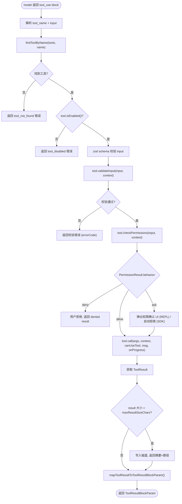

# 02 - Tool 工具系统

> 源码位置: `src/Tool.ts` (793行, 29KB) + `src/tools.ts` (390行, 17KB) + `src/tools/` (42个工具子目录)

Tool 系统是原版 Claude Code 的**工具定义、注册、权限校验与执行渲染**的统一框架。它通过 `buildTool()` 工厂函数为每个工具注入默认行为，并由 `tools.ts` 将所有工具汇集为全局 `Tools` 数组供 QueryEngine 使用。

---

## 1. 数据流图

```mermaid
graph TD
    subgraph 工具定义层 (src/tools/)
        BT["BashTool"] --> BF["buildTool(def)"]
        FE["FileEditTool"] --> BF
        FR["FileReadTool"] --> BF
        FW["FileWriteTool"] --> BF
        GT["GrepTool"] --> BF
        GL["GlobTool"] --> BF
        AT["AgentTool"] --> BF
        WS["WebSearchTool"] --> BF
        WF["WebFetchTool"] --> BF
        NE["NotebookEditTool"] --> BF
        MCPTool["MCPTool (动态)"] --> BF
        Others["...其余30+工具"] --> BF
    end

    BF -- "填充默认方法" --> ToolInstance["完整 Tool 实例"]
    ToolInstance --> Registry["tools.ts 全局注册表"]
    Registry -- "getTools() / feature-gated 过滤" --> ToolsArray["Tools (readonly Tool[])"]

    subgraph 运行时执行
        ToolsArray --> QueryEngine["QueryEngine / query.ts"]
        QueryEngine -- "model 返回 tool_use" --> FindTool["findToolByName(tools, name)"]
        FindTool --> Validate["tool.validateInput()"]
        Validate --> CheckPerm["tool.checkPermissions()"]
        CheckPerm --> CanUseTool["canUseTool() 权限回调"]
        CanUseTool -- "allow" --> Call["tool.call(args, context)"]
        CanUseTool -- "deny" --> Denied["返回拒绝结果"]
        Call --> Result["ToolResult<Output>"]
        Result --> MapResult["tool.mapToolResultToToolResultBlockParam()"]
    end
```

---

## 2. 入口与出口函数

### 2.1 入口: `buildTool(def)` — 工具构建工厂

```typescript
// 文件: src/Tool.ts:783
export function buildTool<D extends AnyToolDef>(def: D): BuiltTool<D>
```

- **输入**: `ToolDef` 对象（可省略部分默认方法）
- **输出**: 完整的 `Tool` 实例
- **默认填充**:
  - `isEnabled` → `true`
  - `isConcurrencySafe` → `false`（默认不安全）
  - `isReadOnly` → `false`（默认假设有写入）
  - `checkPermissions` → `{ behavior: 'allow' }`（交给通用权限系统）

### 2.2 核心入口: `Tool.call()` — 工具执行

```typescript
// 文件: src/Tool.ts:379
call(
  args: z.infer<Input>,
  context: ToolUseContext,
  canUseTool: CanUseToolFn,
  parentMessage: AssistantMessage,
  onProgress?: ToolCallProgress<P>
): Promise<ToolResult<Output>>
```

**ToolResult 结构:**

| 字段 | 类型 | 说明 |
|------|------|------|
| `data` | `Output` | 工具返回数据 |
| `newMessages` | `Message[]?` | 工具产生的附加消息 |
| `contextModifier` | `fn?` | 修改后续工具的上下文 |
| `mcpMeta` | `object?` | MCP 协议元数据透传 |

### 2.3 出口: `getTools()` — 全局工具注册

```typescript
// 文件: src/tools.ts (简化)
export function getTools(options: ToolsOptions): Tools
```

该函数通过 feature flag 条件加载汇集 42+ 种工具：
- **始终加载**: BashTool, FileEditTool, FileReadTool, FileWriteTool, GlobTool, GrepTool, AskUserQuestionTool, WebSearchTool, WebFetchTool
- **条件加载**: REPLTool (ant-only), SleepTool (PROACTIVE flag), CronTools (AGENT_TRIGGERS), AgentTool (subagent), MCPTool (动态注册)
- **延迟加载**: TeamCreateTool, TeamDeleteTool, SendMessageTool (打破循环依赖)

---

## 3. 结构流程图 — 工具执行全链路



---

## 4. 核心设计原理

### 4.1 Zod Schema 驱动的类型安全
每个 Tool 的 `inputSchema` 是一个 `z.ZodType` 实例（来自 Zod v4）。API 返回的 tool_use input 在进入 `call()` 之前会经过 Zod 校验：
- 严格模式（`tool.strict = true`）下，API 层面就保证参数符合 schema。
- 不严格时，运行时 parse 失败会触发 `validateInput` 返回错误码。

### 4.2 三层权限模型
原版采用**定义 → 通用 → 用户**三层权限：
1. **`tool.checkPermissions()`**: 工具自定义的细粒度规则（如 BashTool 检查 `rm -rf /` 等危险命令）。
2. **通用权限系统** (`src/utils/permissions/`): 基于 `.claude/settings.json` 的 always-allow / always-deny / always-ask 规则。
3. **`canUseTool()` 回调**: QueryEngine 注入的最终裁定函数（REPL 弹出确认框 / SDK 按 policy 自动决定）。

### 4.3 工具搜索与延迟加载 (ToolSearch)
当工具数量超过模型上下文能高效处理的范围时，部分工具标记 `shouldDefer: true`，在首次对话时以 `defer_loading: true` 传给 API（仅包含名称和 searchHint，不含完整 schema）。模型需先调用 `ToolSearchTool` 进行关键词搜索，发现相关工具后才能使用。这将初始 prompt 的 token 占用从 42 个完整工具降低到约 10 个。

### 4.4 完整的工具清单 (42+)

| 类别 | 工具 |
|------|------|
| **文件操作** | BashTool, FileReadTool, FileWriteTool, FileEditTool, NotebookEditTool |
| **搜索** | GrepTool, GlobTool, WebSearchTool, WebFetchTool, ToolSearchTool |
| **交互** | AskUserQuestionTool, BriefTool, TodoWriteTool |
| **Agent** | AgentTool, TaskCreateTool, TaskGetTool, TaskListTool, TaskStopTool, TaskUpdateTool, TaskOutputTool |
| **Team** | TeamCreateTool, TeamDeleteTool, SendMessageTool |
| **MCP** | MCPTool, ListMcpResourcesTool, ReadMcpResourceTool, McpAuthTool |
| **模式控制** | EnterPlanModeTool, ExitPlanModeTool, EnterWorktreeTool, ExitWorktreeTool |
| **其他** | LSPTool, REPLTool, SkillTool, ConfigTool, SleepTool, ScheduleCronTool, PowerShellTool, RemoteTriggerTool, SyntheticOutputTool |
