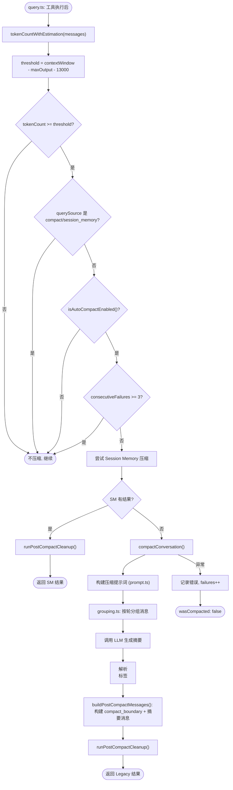

# 03 - Compact 会话压缩系统

> 源码位置: `src/services/compact/` (11个文件, 含 compact.ts 60KB, autoCompact.ts 12KB, microCompact.ts 19KB, sessionMemoryCompact.ts 21KB)

Compact 系统是原版 Claude Code 的**对话上下文管理核心**，负责在 token 接近模型上下文窗口上限时，自动触发会话历史压缩，防止 API 报错 `prompt_too_long`。它包含多种压缩策略：传统压缩（legacy compact）、微压缩（microcompact）、Session Memory 压缩和响应式压缩（reactive compact）。

---

## 1. 数据流图

```mermaid
graph TD
    QueryLoop["query.ts 主循环"] -- "每轮检查" --> ShouldAC["shouldAutoCompact(messages, model)"]
    ShouldAC -- "token > threshold" --> ACIN["autoCompactIfNeeded()"]

    subgraph autoCompactIfNeeded 调度器
        ACIN --> CB{"断路器: consecutiveFailures >= 3?"}
        CB -- "是" --> Skip["跳过压缩"]
        CB -- "否" --> TrySM["1. trySessionMemoryCompaction()"]
        TrySM -- "成功" --> SMResult["返回 SM 压缩结果"]
        TrySM -- "失败/不适用" --> TryLegacy["2. compactConversation()"]
        TryLegacy -- "成功" --> LegacyResult["返回 Legacy 压缩结果"]
        TryLegacy -- "异常" --> IncFail["consecutiveFailures++"]
    end

    subgraph compactConversation 核心 (compact.ts)
        TryLegacy --> BuildPrompt["buildCompactPrompt() 构建压缩提示词"]
        BuildPrompt --> CallAPI["调用 LLM 生成压缩摘要"]
        CallAPI --> ParseSummary["解析 XML 标签中的摘要内容"]
        ParseSummary --> BuildPost["buildPostCompactMessages() 构建新消息链"]
        BuildPost --> Cleanup["runPostCompactCleanup()"]
    end

    subgraph 微压缩 (microCompact.ts)
        QueryLoop -- "API 返回后" --> MCCheck["checkMicroCompact()"]
        MCCheck -- "单条 tool_result 过长" --> MCExec["就地截断/摘要该条结果"]
    end

    SMResult --> Return["返回给 query.ts"]
    LegacyResult --> Return
```

---

## 2. 入口与出口函数

### 2.1 入口: `shouldAutoCompact()` — 触发判定

```typescript
// 文件: src/services/compact/autoCompact.ts:160
export async function shouldAutoCompact(
  messages: Message[],
  model: string,
  querySource?: QuerySource,
  snipTokensFreed?: number
): Promise<boolean>
```

**触发条件**:
- `tokenCountWithEstimation(messages) >= getAutoCompactThreshold(model)`
- 阈值 = `getEffectiveContextWindowSize(model) - 13,000`
- 排除递归场景：`querySource` 为 `session_memory` 或 `compact` 时直接返回 false

### 2.2 核心入口: `autoCompactIfNeeded()` — 压缩调度器

```typescript
// 文件: src/services/compact/autoCompact.ts:241
export async function autoCompactIfNeeded(
  messages: Message[],
  toolUseContext: ToolUseContext,
  cacheSafeParams: CacheSafeParams,
  querySource?: QuerySource,
  tracking?: AutoCompactTrackingState
): Promise<{ wasCompacted: boolean; compactionResult?: CompactionResult; consecutiveFailures?: number }>
```

### 2.3 出口: `compactConversation()` — Legacy 压缩执行

```typescript
// 文件: src/services/compact/compact.ts (主体)
export async function compactConversation(
  messages: Message[],
  toolUseContext: ToolUseContext,
  cacheSafeParams: CacheSafeParams,
  suppressUserQuestions: boolean,
  customInstructions?: string,
  isAutoCompact?: boolean,
  recompactionInfo?: RecompactionInfo
): Promise<CompactionResult>
```

**CompactionResult 结构:**

| 字段 | 类型 | 说明 |
|------|------|------|
| `messages` | `Message[]` | 压缩后的新消息链 |
| `summary` | `string` | 生成的压缩摘要文本 |
| `tokensBeforeCompaction` | `number` | 压缩前 token 数 |
| `tokensAfterCompaction` | `number` | 压缩后 token 数 |

---

## 3. 结构流程图 — 完整压缩决策链



---

## 4. 核心设计原理

### 4.1 多策略压缩架构
原版并非只有一种压缩方式，而是精心设计了**四级压缩梯度**：

| 策略 | 文件 | 时机 | 特点 |
|------|------|------|------|
| **MicroCompact** | `microCompact.ts` (19KB) | API 返回后立即 | 就地截断单条过大的 tool_result，不调用 LLM |
| **Session Memory** | `sessionMemoryCompact.ts` (21KB) | autoCompact 优先尝试 | 基于 Session Memory 服务的结构化裁剪 |
| **Legacy Compact** | `compact.ts` (60KB) | SM 失败后回退 | 调用 LLM 生成全局摘要，替换整个消息链 |
| **Reactive Compact** | `reactiveCompact.ts` | API 返回 prompt_too_long 时 | 被动响应，仅在真正超限时触发 |

### 4.2 上下文窗口精密计算
```
effectiveContextWindow = getContextWindowForModel(model) - min(maxOutputTokens, 20000)
autoCompactThreshold   = effectiveContextWindow - 13000  (AUTOCOMPACT_BUFFER_TOKENS)
warningThreshold       = effectiveContextWindow - 20000  (WARNING_THRESHOLD_BUFFER_TOKENS)
blockingLimit          = effectiveContextWindow - 3000   (MANUAL_COMPACT_BUFFER_TOKENS)
```

- `getContextWindowForModel()`: 根据模型名返回上下文窗口大小（Claude 3.5 Sonnet = 200K，GPT-4 = 128K 等）
- 环境变量 `CLAUDE_CODE_AUTO_COMPACT_WINDOW` 可覆盖上下文窗口大小
- 环境变量 `CLAUDE_AUTOCOMPACT_PCT_OVERRIDE` 可按百分比覆盖阈值

### 4.3 断路器防护 (Circuit Breaker)
当压缩连续失败 3 次（`MAX_CONSECUTIVE_AUTOCOMPACT_FAILURES = 3`）后，断路器跳闸，**本 session 内不再尝试自动压缩**。这是因为 Anthropic 发现约 1,279 个 session 出现了 50+ 次连续失败（最多 3,272 次），每天浪费约 25 万次 API 调用。断路器从根本上解决了这一资源泄漏问题。

### 4.4 compact_boundary 消息协议
压缩完成后，系统在消息链中插入一条 `{ type: 'system', subtype: 'compact_boundary' }` 消息，其 `compactMetadata` 中包含 `preservedSegment` 信息：
- `tailUuid`: 保留段最后一条消息的 UUID
- `headUuid`: 保留段第一条消息的 UUID
- 这使得 `--resume` 恢复时可以精确重建上下文，而不必重新加载整个历史
