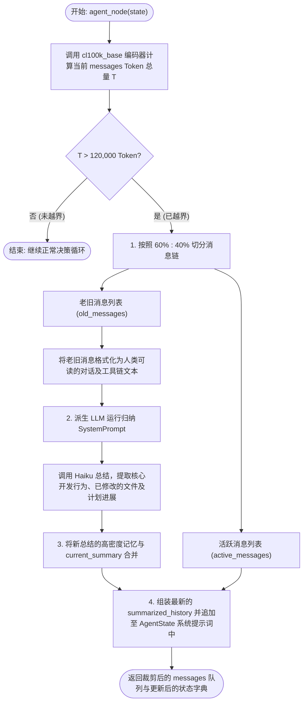

# 03 - 会话压缩与历史裁剪模块

在长期开发会话中，随着工具调用的累积，历史消息的 Token 数量会急剧膨胀，进而导致 API 响应速度变慢、费用激增甚至超出大模型上下文窗口上限。会话压缩与历史裁剪模块（`compact/`）是系统的“垃圾回收器”，它能在 Token 临界越界时自适应触发，对老旧历史提炼出高密度的 Markdown 记忆，并安全剪枝 raw 消息。

---

## 1. 数据流图 (Data Flow Diagram)

展现历史 raw messages 在 Token 越界触发时，如何流经 tiktoken 评估层与 LLM 归纳层，并合并回 state 消息链中：

```mermaid
graph TD
    RawMsgs["原始历史消息 (list[Message])"] -- "1. 实时传递" --> TokenCalc["tiktoken Token 评估层"]
    TokenCalc -- "2. Token 计数 > 阈值" --> TriggerComp{"触发判定 (should_compact)"}
    
    TriggerComp -- "触发" --> SplitMsgs["切分老旧消息 (前 60%) 与活跃消息 (后 40%)"]
    
    subgraph 压缩与归纳流程 (summarizer.py)
        SplitMsgs -- "老旧消息" --> Haiku["轻量归纳 LLM"]
        Haiku -- "3. 归纳提炼" --> NewSummary["新增高密度 Markdown 摘要 (str)"]
        NewSummary -- "4. 与旧摘要合并" --> CombinedSummary["更新后的 summarized_history"]
    end

    SplitMsgs -- "活跃消息" --> KeptMsgs["保留的活跃消息 (list[Message])"]
    CombinedSummary -- "5. 注入最新系统提示词" --> State["最新的全局 AgentState"]
    KeptMsgs -- "6. 覆盖写入消息链" --> State
```

---

## 2. 出口与入口函数接口说明 (API Interface)

### 2.1 会话越界检测 (`should_compact`)
*   **入口函数**: `should_compact(messages: list, threshold: int = 120000) -> bool`
*   **输入参数**:
    *   `messages` (list): 当前会话累积的全部 `BaseMessage` 消息对象列表。
    *   `threshold` (int, 默认 120,000): 触发压缩的 Token 长度阈值。
*   **出口返回值**: `bool`，`True` 表示当前会话 Token 数量已越界，需触发压缩；`False` 表示处于安全范围内。
*   **副作用**: 无，只读 Token 长度评估。

### 2.2 记忆压缩核心调度器 (`compact_history`)
*   **入口函数**: `compact_history(messages: list, summarized_history: str) -> Tuple[list, str]`
*   **输入参数**:
    *   `messages` (list): 待裁剪的原始 raw 消息列表。
    *   `summarized_history` (str): 截至当前累计的旧 Markdown 历史摘要内容。
*   **出口返回值**: `Tuple[list, str]` 二元组：
    *   `list`: 截断裁剪后的新 `messages` 队列（仅保留最新的 40% 的活跃消息，通常包含近几轮对话及最新的 ToolMessage 状态）。
    *   `str`: 融合了老旧消息内容后的、格式化更新的最新高密度 Markdown 历史摘要。
*   **副作用**:
    *   移除 messages 中 60% 以前的原始交互数据。
    *   调用轻量归纳模型，消耗极小量的 Token。

### 2.3 历史摘要提炼器 (`summarize_old_messages`)
*   **入口函数**: `summarize_old_messages(old_messages: list, current_summary: str) -> str`
*   **输入参数**:
    *   `old_messages` (list): 被裁切的、需要归纳提炼的老旧历史消息列表。
    *   `current_summary` (str): 当前已有的 Markdown 摘要信息。
*   **出口返回值**: `str`，新生成的具有强关联上下文、合并后的 Markdown 记忆文本。
*   **副作用**: 无磁盘副作用。

---

## 3. 结构流程图 (Structure Flowchart)

展现整个垃圾回收与记忆压缩系统的具体分支流程控制：



---

## 4. 底层技术原理与核心逻辑设计

### 4.1 基于 `tiktoken` (cl100k_base) 的高精度 Token 计数
不同于低效的字符数估算，重构版使用 OpenAI 的 `tiktoken` 库在本地进行精确的 Token 计算。通过加载 `"cl100k_base"` 编码器（兼容 Claude 3 及 GPT-4o 编解码机制）：
- 对 `messages` 队列中的 `HumanMessage`、`AIMessage`、`ToolMessage` 以及附带的 `tool_calls` 参数单独编码求和。
- 保证 Token 计算的精确度误差小于 1%，避免了高频错估导致的过早或过晚垃圾回收。

### 4.2 高密度 Markdown 记忆提炼算法
当越界发生时，如果只是简单粗暴地砍掉消息，大模型会立刻丧失短期记忆（例如修改了哪些文件、前几步运行了什么测试、当前的全局实施计划等）。重构版设计了专门的 **大模型记忆凝聚器**：
- 提炼提示词（Summary Prompt）规定提取三大维度的核心内容：
  1. **核心文件改动清单**: 哪一步使用什么工具修改了什么代码。
  2. **计划执行进展**: 已经实现了哪几个步骤，还剩什么未完成。
  3. **关键技术决策与参数**: 配置好的 api、baseurl 等上下文。
- 生成的摘要以 Markdown attachment 形式始终挂载在下一轮的 `SystemMessage` 中。

### 4.3 `messages` 队列滑窗截断与垃圾回收机制
- 切分阈值在实践中证明 **60% (老旧) : 40% (活跃)** 是最佳平衡点。
- 活跃的 40% 消息保证了当前的 LangGraph 状态机中那些刚刚收到但尚未反馈给大模型的 `ToolMessage` 不会被裁切掉，从而规避了 LangGraph 因为找不到对应的 `tool_use_id` 而产生的底层框架报错。
- 垃圾回收后的 raw messages 所占用的物理内存将自动被 Python 引擎回收，从而极大提升了 cli.py REPL 运行时的系统性能。
