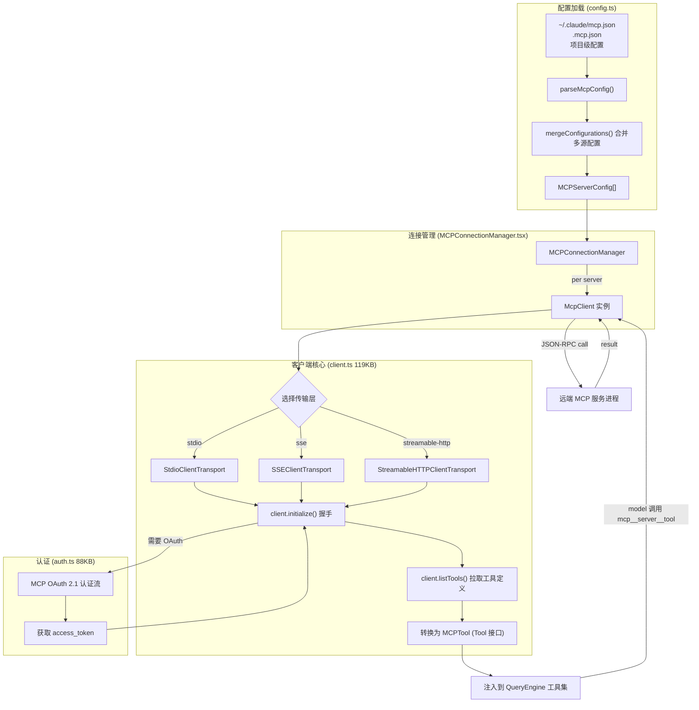
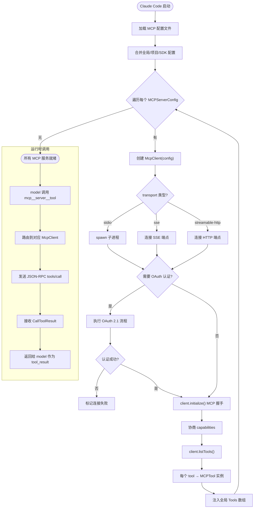

# 04 - MCP 客户端协议系统

> 源码位置: `src/services/mcp/` (23个文件, 含 client.ts 119KB, config.ts 51KB, auth.ts 88KB)

MCP（Model Context Protocol）客户端是原版 Claude Code 的**外部工具生态扩展引擎**。它实现了完整的 MCP 协议栈，支持 stdio / SSE / StreamableHTTP 三种传输层，管理与多个 MCP 服务端的并发连接，并将外部工具动态注入到模型的工具集中。

---

## 1. 数据流图



---

## 2. 入口与出口函数

### 2.1 入口: MCP 配置加载

```typescript
// 文件: src/services/mcp/config.ts
export function getMcpConfigurations(): MCPServerConfig[]
export function parseMcpConfig(configPath: string): MCPConfig
```

**MCPServerConfig 关键字段:**

| 字段 | 类型 | 说明 |
|------|------|------|
| `name` | `string` | 服务端名称 |
| `command` | `string` | 启动命令 (stdio) |
| `args` | `string[]` | 命令参数 |
| `env` | `Record<string, string>` | 环境变量 (支持 `${VAR}` 扩展) |
| `url` | `string` | SSE/HTTP 端点 URL |
| `transport` | `'stdio' \| 'sse' \| 'streamable-http'` | 传输方式 |

### 2.2 核心入口: 客户端连接与工具获取

```typescript
// 文件: src/services/mcp/client.ts
export class McpClient {
  async connect(): Promise<void>
  async listTools(): Promise<McpClientTool[]>
  async callTool(name: string, args: Record<string, unknown>): Promise<CallToolResult>
  async listResources(): Promise<Resource[]>
  async readResource(uri: string): Promise<ReadResourceResult>
}
```

### 2.3 出口: MCPTool 动态生成

MCP 服务端导出的工具被转换为实现 `Tool` 接口的 `MCPTool` 实例，名称格式为 `mcp__<serverName>__<toolName>`：
- `inputJSONSchema` 直接使用服务端提供的 JSON Schema（不转 Zod）
- `call()` 内部调用 `client.callTool()` 进行 JSON-RPC 转发
- 结果通过 `mapToolResultToToolResultBlockParam()` 转为标准工具结果

---

## 3. 结构流程图 — MCP 完整生命周期



---

## 4. 核心设计原理

### 4.1 三种传输层实现
原版 MCP 客户端支持完整的三种标准传输层：
- **Stdio**: 最常见，通过 `spawn` 启动本地 MCP 服务进程，以 stdin/stdout JSON-RPC 通信
- **SSE**: 通过 Server-Sent Events 连接远端 HTTP MCP 服务
- **Streamable HTTP**: 通过 HTTP POST 请求发送调用、以流式响应接收结果

每种传输均封装在 `@modelcontextprotocol/sdk` 提供的标准 Transport 类中。

### 4.2 OAuth 2.1 认证体系 (auth.ts — 88KB)
这是 MCP 系统中最复杂的部分，支持：
- **Server-driven OAuth**: MCP 服务端返回 `-32042` 错误码时触发 OAuth 流程
- **Provider discovery**: 自动发现 `/.well-known/oauth-authorization-server` 端点
- **PKCE 扩展**: 使用 S256 code challenge 防止授权码截获攻击
- **Token 持久化**: access_token / refresh_token 存储在本地安全存储中
- **XAA (Cross-App Auth)**: Anthropic 内部的跨应用认证协议

### 4.3 环境变量扩展 (`envExpansion.ts`)
MCP 配置中的环境变量支持 `${VAR_NAME}` 语法进行动态替换，例如：
```json
{ "env": { "DB_URL": "${DATABASE_URL}" } }
```
系统在启动时将 `${DATABASE_URL}` 替换为实际环境变量值，支持嵌套和默认值。

### 4.4 连接管理与重连
`MCPConnectionManager` 组件负责：
- 管理多个 MCP 服务端的并发连接生命周期
- 连接断开时自动重连
- 服务端 capability 变更时重新 listTools
- 热重载：用户修改 `.mcp.json` 后无需重启即可应用新配置
