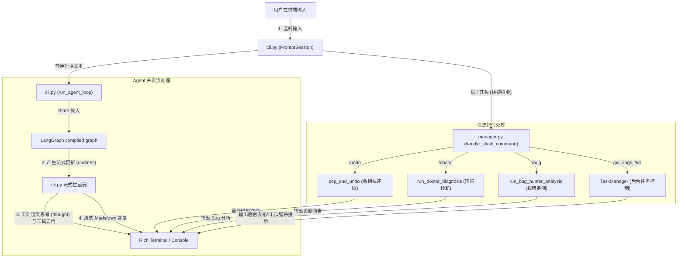
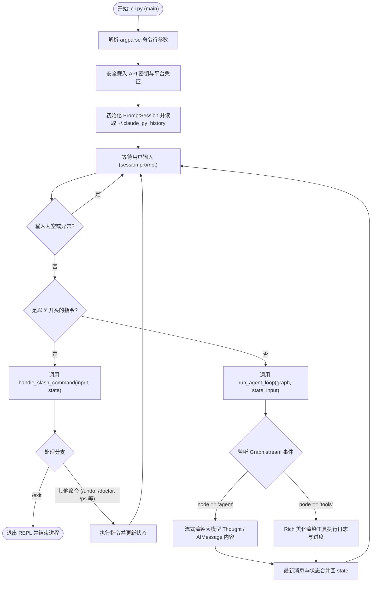

# 04 - 命令行REPL与快捷指令模块

命令行 REPL 与快捷指令模块是 `claude-py` 的核心用户交互界面（UI/UX）。该模块基于高颜值和流畅度设计，提供基于大模型流式思考、工具执行实时进度条和高保真 Markdown 渲染的用户终端。同时提供一组丰富的快捷指令（Slash Commands）以及在内存中进行文件防灾备份并支持一键撤销（`/undo`）的防灾机制。

---

## 1. 数据流图 (Data Flow Diagram)

展现用户通过命令行交互，触发快捷指令本地执行，或者分发至 LangGraph Agent 并流式接收回复的数据流转：

---

## 2. 出口与入口函数接口说明 (API Interface)

### 2.1 交互终端主入口 (`main`)
*   **入口函数**: `main() -> None`
*   **输入参数**: 无（命令行参数通过 `argparse` 解析）。
*   **出口返回值**: 无，进程退出。
*   **副作用**:
    *   启动终端 REPL 会话循环。
    *   在缺失 `CLAUDE_API_KEY` 时，会自动调用 `keyring` 凭证检索并可能产生终端隐式输入与写入 Keychain 副作用。

### 2.2 快捷指令分发路由器 (`handle_slash_command`)
*   **入口函数**: `handle_slash_command(command: str, state: dict) -> Tuple[bool, dict]`
*   **输入参数**:
    *   `command` (str): 以 `/` 开头的快捷指令文本（例如 `/logs 1`）。
    *   `state` (dict): 当前会话的全局状态。
*   **出口返回值**: `Tuple[bool, dict]` 二元组：
    *   `bool`: `True` 表示命令已被成功拦截并处理，REPL 继续会话；`False` 表示用户请求退出（如 `/exit`），终端将会退出。
    *   `dict`: 快捷指令处理或状态重置后的全新 `state` 字典。
*   **副作用**:
    *   `/clear` 会清空 `messages` 对话链。
    *   `/undo` 触发磁盘文件内容回退。
    *   `/kill` 终止后台并发运行的 shell 进程。

### 2.3 防灾撤销栈回滚 (`pop_and_undo`)
*   **入口函数**: `pop_and_undo() -> str`
*   **输入参数**: 无。
*   **出口返回值**: `str`，包含回滚操作成功或状态栈已空的状态消息提示。
*   **副作用**:
    *   直接覆盖回弹磁盘上的文件，将其完全还原为修改前的历史状态。

---

## 3. 结构流程图 (Structure Flowchart)

展现交互式 REPL 终端及快捷指令拦截的核心执行分支流程：

---

## 4. 底层技术原理与核心逻辑设计

### 4.1 `prompt-toolkit` 会话历史加载与拦截机制
重构版在 [cli.py](file:///Users/jiayi/work/code/paly/claude-code-python/claude_code/cli.py) 中引入了 `PromptSession`：
- 配置 `FileHistory(os.path.expanduser("~/.claude_py_history"))`，确保用户跨终端启动 `claude-py` 时，上下方向键能够无缝滚出上一次的交互指令，体验媲美物理 bash 终端。
- 拦截层具有高度健壮性，捕获了 `KeyboardInterrupt` (Ctrl+C) 和 `EOFError` (Ctrl+D) 信号，以防止大模型出现异常死循环或失联时造成终端崩溃挂起。

### 4.2 `/undo` 防灾回滚栈算法
为了绝对防止大模型在修改复杂逻辑代码时产生毁灭性覆盖错误，重构版设计了极其安全的 **内存文件快照栈** [file_undo.py](file:///Users/jiayi/work/code/paly/claude-code-python/claude_code/tools/file_undo.py)：
- **自动压栈**: 无论是 `write_file_tool` 还是 `edit_file_tool` 在成功把数据写入物理磁盘前，如果文件已经存在，都会自动调用 `push_file_backup(file_path)`。
- **快照格式**: 获取文件的实时绝对路径，并以读取到的 raw 文本形式压入全局双向内存队列中。
- **一键回弹**: 当用户在终端键入 `/undo` 时，`pop_and_undo()` 会弹出栈顶元素，获取对应路径，将备份内容覆写回去。大模型造成的误改在一秒内便可完美还原！

### 4.3 Rich 高颜值流式渲染设计
- **样式主题 (Theme)**: 自定义了 `custom_theme` 包含了 `info`, `warning`, `danger`, `thought` (优雅白斜体), `tool` (醒目绿) 等 HSL Tailored 现代美学样式。
- **思维流 (Thought Stream)**: 大模型的分析思路会被渲染进 `[thought]Thinking...[/thought]` 面板，展示极致工业级的实时交互动效。
