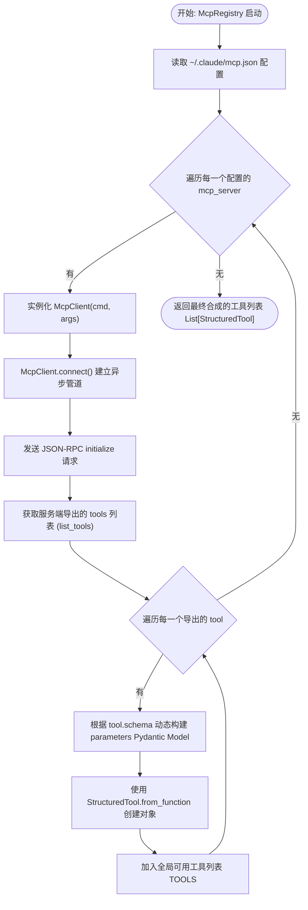

# 05 - MCP客户端协议扩展模块

MCP（Model Context Protocol）客户端协议扩展模块是系统与三方工具生态（例如 Chromium-browser、PostgreSQL 等）进行动态、标准协议级握手扩展的“即插即用”式核心引擎。它基于异步 stdio 管道及 JSON-RPC 2.0 协议标准，允许大模型在运行时动态发现、绑定并调用外部服务导出的无限工具集。

---

## 1. 数据流图 (Data Flow Diagram)

展现系统在启动时读取本地配置、初始化异步 stdio 守护进程、注册转换工具，并在 LLM 发起工具调用时进行 RPC 封包流转的过程：

```mermaid
graph TD
    Config["本地配置文件 ~/.claude/mcp.json"] -- "1. 启动加载" --> Reg["McpRegistry (registry.py)"]
    
    subgraph Stdio JSON-RPC 2.0 管道 (client.py)
        Reg -- "2. 派生异步子进程 (command)" --> Client["McpClient"]
        Client -- "3. 初始化握手 (initialize)" --> ServerProcess["三方 MCP 工具服务端"]
    end

    ServerProcess -- "4. 响应支持的工具定义 (schema)" --> Client
    Client -- "5. 解析工具" --> Reg
    Reg -- "6. 动态转换为 StructuredTool" --> Agent["LangGraph Agent 大脑"]

    Agent -- "7. 大模型调用该三方工具" --> Client
    Client -- "8. 封包为 JSON-RPC call" --> ServerProcess
    ServerProcess -- "9. 返回执行结果 (result)" --> Client
    Client -- "10. 返回给大模型" --> Agent
```

---

## 2. 出口与入口函数接口说明 (API Interface)

### 2.1 异步 stdio MCP 管道连接 (`McpClient.connect`)
*   **入口函数**: `async def connect(self) -> None`
*   **输入参数**: 无（相关 command、args 在类实例化时传入）。
*   **出口返回值**: 无（`None`），但内部将成功建立异步子进程 stdio 连接句柄。
*   **副作用**:
    *   在后台以守护状态派生三方工具的进程。
    *   在后台启动并运行两个并发的 `asyncio` 轮询任务以实时监听管道的 `stdout` 与 `stderr`。

### 2.2 三方工具调用反射 (`McpClient.call_tool`)
*   **入口函数**: `async def call_tool(self, name: str, arguments: dict) -> dict`
*   **输入参数**:
    *   `name` (str): 待调用的三方工具名称。
    *   `arguments` (dict): 参数键值对。
*   **出口返回值**: `dict`，三方服务端返回的 JSON-RPC 2.0 原生 `result` 包（通常包含文本或图片数据列表）。
*   **副作用**:
    *   调用可能触发三方服务本地磁盘、网络或浏览器控制等全部副作用。

### 2.3 MCP 工具链动态注册机 (`McpRegistry.register_all_tools`)
*   **入口函数**: `register_all_tools(self) -> List[StructuredTool]`
*   **输入参数**: 无。
*   **出口返回值**: `List[StructuredTool]`，可以直接绑定给 LangChain Chat Model（如 ChatAnthropic / ChatOpenAI）的 `bind_tools` 接口的 StructuredTool 实例列表。
*   **副作用**:
    *   拉起配置文件中定义的所有三方 MCP 进程。

---

## 3. 结构流程图 (Structure Flowchart)

展现 MCP 客户端与服务端握手以及动态工具封装的流程分支控制：



---

## 4. 底层技术原理与核心逻辑设计

### 4.1 JSON-RPC 2.0 异步管道与 Stdio 的无缝通信
重构版在 [client.py](file:///Users/jiayi/work/code/paly/claude-code-python/claude_code/mcp/client.py) 中，完全手写并实现了一套高健壮性的 **JSON-RPC 2.0 异步协议解析器**：
- 使用 `asyncio.create_subprocess_exec` 拉起后台三方进程，将 `stdin` 和 `stdout` 设置为 `subprocess.PIPE`。
- 发送时对 payload 进行 UTF-8 编码，并以换行符 `\n` 标志结束写入 `stdin`，然后调用 `drain()` 冲刷写入。
- 监听端以 `readline()` 循环无阻塞地实时读取 `stdout`。当成功抓取到一个完整的包含 `jsonrpc: "2.0"` 的 JSON 文本行时，解析其 `id`，并通过内部的 `asyncio.Future` 完成异步任务的精准调度映射与状态回弹。

### 4.2 三方工具动态 Pydantic 解析与有损映射方案
在原版 TypeScript 中，工具参数的校验基于运行时的 JSON-schema，而 Python 社区中大模型绑定的核心是 **Pydantic Model**。
重构版在 [registry.py](file:///Users/jiayi/work/code/paly/claude-code-python/claude_code/mcp/registry.py) 中实现了一套高超的 **有损映射器**：
- 抓取到三方导出的参数属性列表后，采用动态元类 `pydantic.create_model`，在运行时将 JSON-schema 规定的 `type`、`properties` 以及 `required` 约束，实时生成一个严格校验的 Pydantic 模型（Parameters Model）。
- 通过 `StructuredTool.from_function` 将此 Pydantic 模型作为 `args_schema`，完美地欺骗并对接给 LangChain 及 LangGraph，使得大模型能够以极其严密且带自动强校验的形式，安全地调配任何三方 MCP 生态工具。
