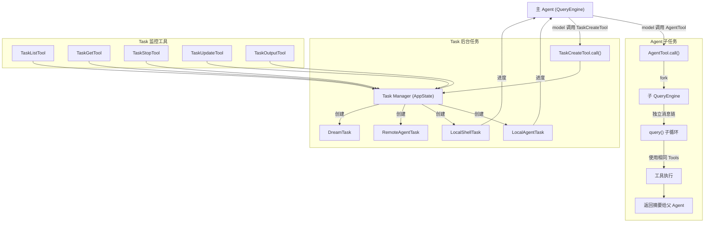
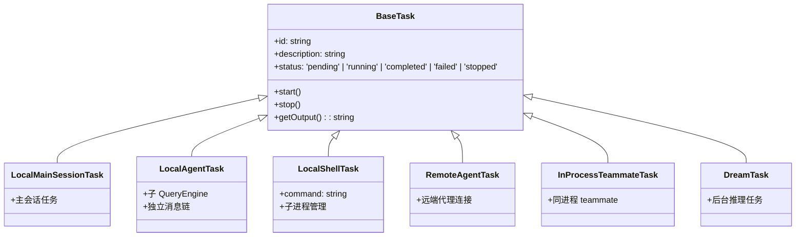
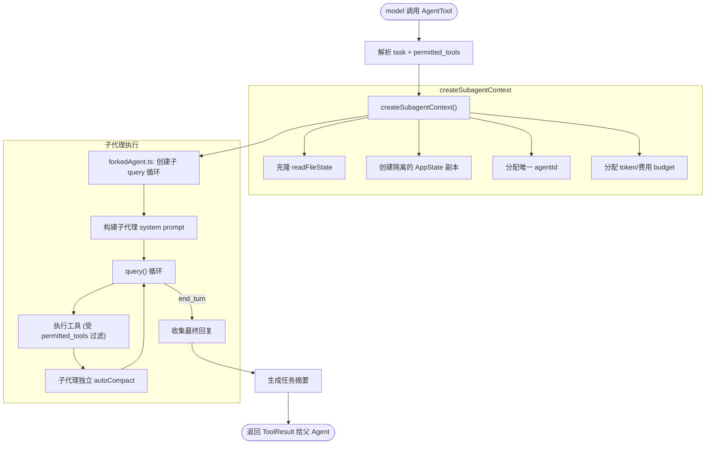
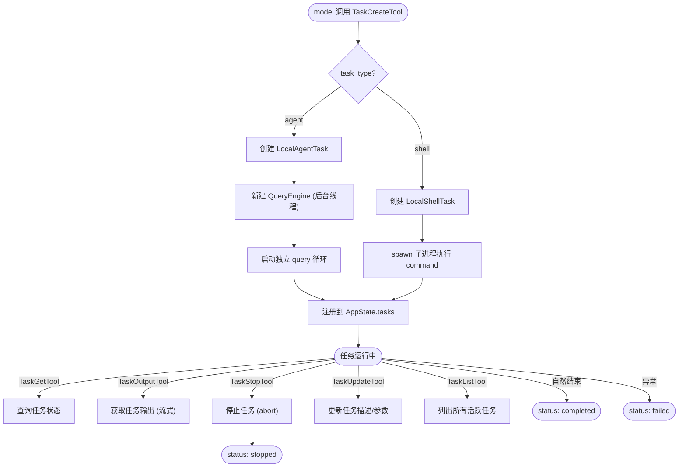

# 05 - Task 多代理任务系统

> 源码位置: `src/tasks/` (5个子目录 + 4个文件) + `src/tools/AgentTool/` + `src/tools/Task*Tool/` (6个任务工具)

Task 系统是原版 Claude Code 的**多代理并发执行引擎**。它支持在主 session 内创建独立的 agent 子任务，每个子任务拥有自己的消息链、工具上下文和生命周期管理。这是 Claude Code 实现"子代理分工协作"（agent swarms）的基础设施。

---

## 1. 数据流图



---

## 2. 入口与出口函数

### 2.1 入口: `AgentTool.call()` — 同步子代理

```typescript
// 文件: src/tools/AgentTool/AgentTool.ts
// 输入 schema:
{
  task: string,           // 子代理任务描述
  permitted_tools?: string[], // 可选的工具白名单
}
```

AgentTool 是**同步阻塞式**的子代理调用——主 Agent 在子代理完成前处于等待状态。它通过 `forkedAgent.ts` 创建一个**隔离的 query 循环**：
- 独立的消息链（不与主 Agent 共享）
- 共享的 readFileState 缓存
- 独立的 autoCompact 跟踪
- 向父 Agent 报告进度（通过 onProgress 回调）

### 2.2 入口: `TaskCreateTool.call()` — 异步后台任务

```typescript
// 文件: src/tools/TaskCreateTool/TaskCreateTool.ts
// 输入 schema:
{
  task_type: 'agent' | 'shell',
  description: string,
  command?: string,       // shell 类型时的命令
  prompt?: string,        // agent 类型时的提示词
}
```

### 2.3 出口: Task 类型继承体系



---

## 3. 结构流程图 — AgentTool 子代理执行



---

## 4. 结构流程图 — Task 后台任务管理



---

## 5. 核心设计原理

### 5.1 Agent 隔离模型
子代理通过 `createSubagentContext()` 实现**深度隔离**：
- **消息隔离**: 独立的 `Message[]`，不污染主 Agent 的消息链
- **状态隔离**: 克隆 `AppState`，但通过 `setAppStateForTasks` 可以向主线程注册基础设施（如后台任务）
- **缓存共享**: `readFileState` (LRU 缓存) 通过引用共享，避免同一文件被多个 Agent 重复读取
- **权限传递**: 子代理继承父代理的权限上下文，但可以通过 `shouldAvoidPermissionPrompts` 标志自动拒绝需要交互的权限请求

### 5.2 预算控制
每个子代理有独立的 token/费用预算：
- `maxTurns`: 限制子代理的最大对话轮次
- `taskBudget.total`: 限制子代理的总费用（美元）
- 当预算耗尽时，子代理被强制终止并返回部分结果

### 5.3 任务 Pill Label (pillLabel.ts)
原版 Claude Code 终端 UI 中，每个任务在状态栏显示一个彩色标签（pill label），颜色编码表示任务状态：
- 🟢 running | 🟡 pending | 🔴 failed | ⚪ completed | ⚫ stopped

### 5.4 Team 协作 (TeamCreateTool / TeamDeleteTool)
在 Agent 之上，原版还支持 **Team**（团队协作），多个 Agent 可以通过 `SendMessageTool` 相互发送消息，实现复杂的多代理协作工作流。Team 功能通过延迟加载打破了与 `tools.ts` 的循环依赖。
