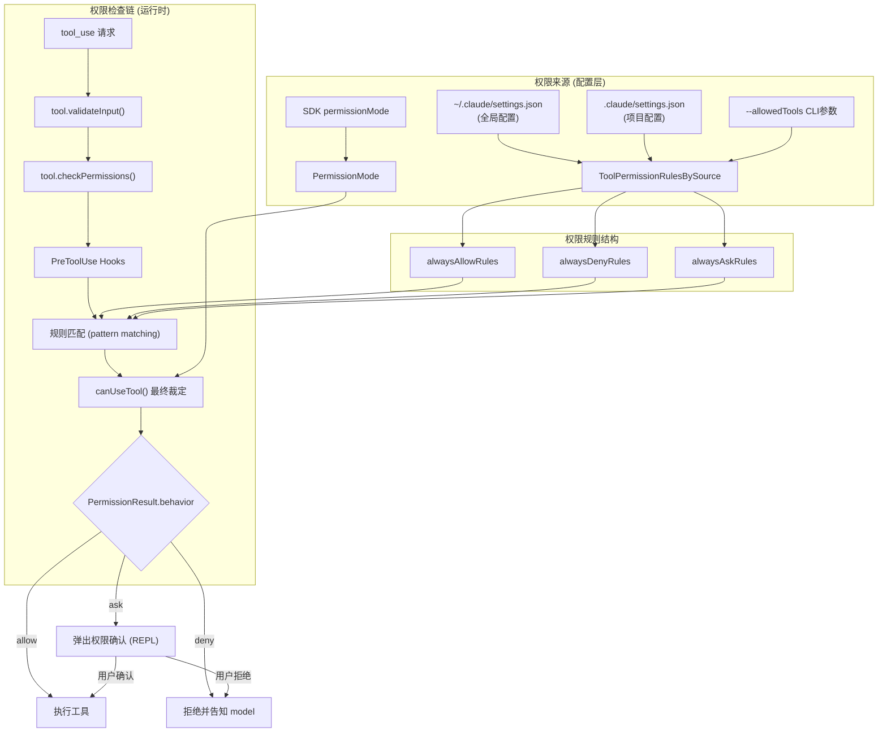
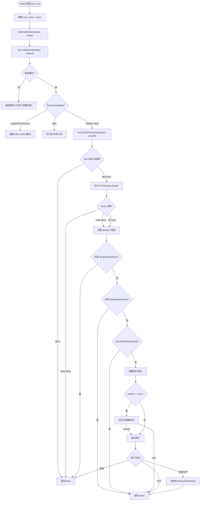

# 06 - Permission 权限控制系统

> 源码位置: `src/utils/permissions/` + `src/types/permissions.ts` + `src/hooks/useCanUseTool.ts` + `src/utils/hooks.ts` (159KB) + `src/Tool.ts` 中的 `ToolPermissionContext`

Permission 系统是原版 Claude Code 的**安全核心**，在每一次工具调用前强制执行权限校验。它实现了从配置文件规则到运行时交互确认的完整权限链路，确保 AI 代理无法在未经授权的情况下执行危险操作。

---

## 1. 数据流图



---

## 2. 入口与出口函数

### 2.1 入口: `ToolPermissionContext` — 权限上下文

```typescript
// 文件: src/Tool.ts:123
export type ToolPermissionContext = DeepImmutable<{
  mode: PermissionMode                       // 'default' | 'plan' | 'bypassPermissions' | 'auto'
  additionalWorkingDirectories: Map<string, AdditionalWorkingDirectory>
  alwaysAllowRules: ToolPermissionRulesBySource
  alwaysDenyRules: ToolPermissionRulesBySource
  alwaysAskRules: ToolPermissionRulesBySource
  isBypassPermissionsModeAvailable: boolean
  isAutoModeAvailable?: boolean
  shouldAvoidPermissionPrompts?: boolean     // 后台 agent 自动拒绝
  prePlanMode?: PermissionMode              // plan mode 切入前的原模式
}>
```

### 2.2 核心入口: `useCanUseTool()` — 权限 Hook

```typescript
// 文件: src/hooks/useCanUseTool.ts
export type CanUseToolFn = (
  tool: Tool,
  input: Record<string, unknown>,
  toolUseContext: ToolUseContext,
  assistantMessage: AssistantMessage,
  toolUseID: string,
  forceDecision?: 'allow' | 'deny'
) => Promise<PermissionResult>
```

### 2.3 出口: `PermissionResult` — 权限决策

```typescript
// 文件: src/types/permissions.ts
export type PermissionResult =
  | { behavior: 'allow'; updatedInput: Record<string, unknown> }
  | { behavior: 'deny'; reason: string }
  | { behavior: 'ask'; message: string; updatedInput: Record<string, unknown> }
```

---

## 3. 结构流程图 — 完整权限检查链



---

## 4. 核心设计原理

### 4.1 三级权限模式 (PermissionMode)

| 模式 | 行为 | 使用场景 |
|------|------|----------|
| `default` | 非只读工具需确认 | 默认交互模式 |
| `plan` | 仅允许只读工具（read, grep, glob）| 规划阶段，禁止修改 |
| `auto` | 先经安全分类器，安全则自动允许 | 自动化执行模式 |
| `bypassPermissions` | 全部允许（"yolo" 模式）| 信任环境下的快速执行 |

### 4.2 模式匹配引擎 (`preparePermissionMatcher`)
工具可以实现 `preparePermissionMatcher()` 方法来支持细粒度的模式匹配。例如 BashTool 的规则 `Bash(git *)` 仅允许 `git` 相关命令：
```typescript
// BashTool 的 preparePermissionMatcher
async preparePermissionMatcher(input: { command: string }) {
  return (pattern: string) => {
    // 将 "git *" 展开为 glob 匹配
    return micromatch.isMatch(input.command, pattern)
  }
}
```

### 4.3 Hooks 系统 (`src/utils/hooks.ts` — 159KB)
权限检查之前会经过**Hooks 前置处理器**。这是 Claude Code 的插件扩展点：
- **PreToolUse Hook**: 在工具执行前介入，可以修改输入、拒绝、或附加额外的系统消息
- **PostToolUse Hook**: 在工具执行后介入，可以修改输出或触发副作用
- Hook 定义在 `.claude/hooks.json` 或通过 SDK 注入
- Hook 可以是本地脚本（bash 命令）或 MCP 工具

### 4.4 拒绝追踪 (Denial Tracking)
系统维护一个 `DenialTrackingState`（位于 `src/utils/permissions/denialTracking.ts`），跟踪同一工具的连续拒绝次数。当拒绝次数超过阈值时，会从"自动拒绝"切换为"弹出确认"，给用户一个明确选择的机会。这防止了 model 反复尝试被拒绝的操作而用户毫无感知的情况。

### 4.5 安全分类器 (Auto Mode)
`auto` 模式下，非只读工具调用会经过一个**安全分类器**：
- 分类器分析工具的输入（通过 `tool.toAutoClassifierInput(input)` 生成分类器输入）
- 判断该调用是否"安全"（如 `git add .` 通常安全，`rm -rf /` 不安全）
- 安全的调用自动批准，不安全的仍然弹出确认
- 分类器审批记录维护在 `classifierApprovals.ts` 中
