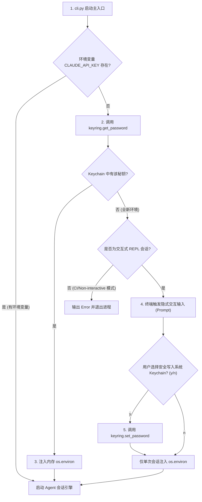
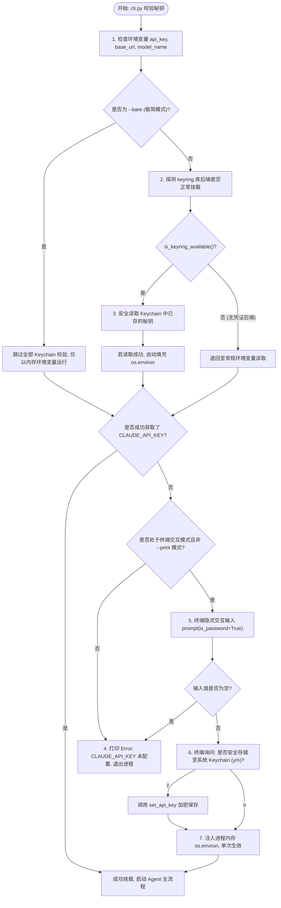

# 07 - Keyring安全密钥管理器模块

Keyring安全密钥管理器模块（`keyring/`）是系统用于加密存储敏感身份认证凭证的平台安全保障子系统。通过深度集成跨平台安全库 `keyring`，该模块免去了用户在物理环境变量或代码中硬编码 `CLAUDE_API_KEY`、`CLAUDE_BASE_URL` 等凭证的安全隐患，对接 macOS Keychain Access 等系统级加密存储服务，并提供优雅的交互式引导绑定体验。

---

## 1. 数据流图 (Data Flow Diagram)

展现系统在启动时如何探测安全凭证，若缺失如何从系统 Keychain 读取，若皆缺失如何引导用户交互式输入并加密持久化流转：

---

## 2. 出口与入口函数接口说明 (API Interface)

### 2.1 物理凭证底层读取器 (`get_secure_credential`)
*   **入口函数**: `get_secure_credential(username: str) -> Optional[str]`
*   **输入参数**:
    *   `username` (str): 加密凭证的唯一标示用户名（如 `"CLAUDE_API_KEY"`、`"CLAUDE_BASE_URL"`）。
*   **出口返回值**: `str` / `None`，若系统凭证库中存在该秘钥且解密成功，返回解密后的明文字符串；若不存在或当前平台不支持凭证库，返回 `None`。
*   **副作用**: 无，只读安全读取。

### 2.2 物理凭证底层写入器 (`set_secure_credential`)
*   **入口函数**: `set_secure_credential(username: str, value: str) -> bool`
*   **输入参数**:
    *   `username` (str): 凭证标识名。
    *   `value` (str): 待写入系统凭证库并自动加密的敏感秘钥字符串。
*   **出口返回值**: `bool`，`True` 表示成功写入并由系统凭证库保存；`False` 表示写入失败（例如权限不足或无 Keychain 守护进程运行）。
*   **副作用**:
    *   在 macOS 上，直接将数据持久化写入 Keychain Access 凭证控制台。

### 2.3 高层秘钥加载器 (`get_api_key` / `set_api_key`)
*   **入口函数**: `get_api_key() -> Optional[str]` 和 `set_api_key(api_key: str) -> bool`
*   **输入参数**: 秘钥字符串。
*   **出口返回值**: 分别为检索到的明文秘钥，或写入成功与否的布尔值。
*   **副作用**: 与底层 API 对齐。

---

## 3. 结构流程图 (Structure Flowchart)

展现 CLI 启动阶段，秘钥自适应探测、 Keychain 挂载与交互式引导写入的具体逻辑分支：

---

## 4. 底层技术原理与核心逻辑设计

### 4.1 对接 Keychain Access 物理系统安全凭证库
重构版在 [auth.py](file:///Users/jiayi/work/code/paly/claude-code-python/claude_code/keyring/auth.py) 中，指定服务名 `SERVICE_NAME = "claude-py"`。
通过在底层加载 Python 的事实标准库 `keyring`：
- 在 **macOS** 平台下：安全对接系统的 Keychain 凭证控制台，由系统使用 PBKDF2 与 AES-256 加密保存。
- 在 **Windows** 平台下：对接 Windows Credential Vault（凭据管理器）。
- 在 **Linux** 平台下：对接 Secret Service API 或者是本地安全 D-Bus 接口。
这使得重构后的命令行工具完全摆脱了在 bash 配置文件中明文暴露秘钥的安全隐患，达到了企业级生产级别的安全性标准。

### 4.2 极度稳健的“无后端”优雅降级设计
如果在 CI/CD 容器环境、或是未挂载桌面环境的极简 Linux 虚拟主机上运行，系统底层通常没有安装或挂载 Keychain 守护进程。如果直接调用 `keyring.get_password`，会导致进程直接抛出 `NoKeyringError` 崩溃。重构版采用了 **稳健的主动防御探测技术**：
- 实现 `is_keyring_available()` 检测：通过写入一个虚拟测试 Key `"test_availability"` 并捕获异常。
- 如果抛出任何报错，立即自动无缝将 keyring 机制进行热降级，完全避开 keyring 的 API 调用，无缝回退到基于内存及常规 OS 环境变量的加载模式。这保证了 `claude-py` 工具在任何恶劣的物理机或 CI 节点上均能 100% 正常运行，绝对不会发生由于环境原因导致的崩溃。

### 4.3 终端隐式输入与自动绑定体验
- **隐式安全输入**: 交互提示使用 `prompt-toolkit` 的 `prompt(is_password=True)`，这确保了用户在终端输入 API Key 时，终端**不会回显任何字符和长度**，从物理上隔绝了在共享屏幕或公开演示时秘钥被截屏泄露的风险。
- **自适应保存**: 输入完毕后，仅需回车确认即可由 `set_api_key` 安全地进行一次性后台 Keychain 持久化写入，使得下次启动工具时达到“零参数、零配置、秒级免密无缝启动”的极致开发体验。
