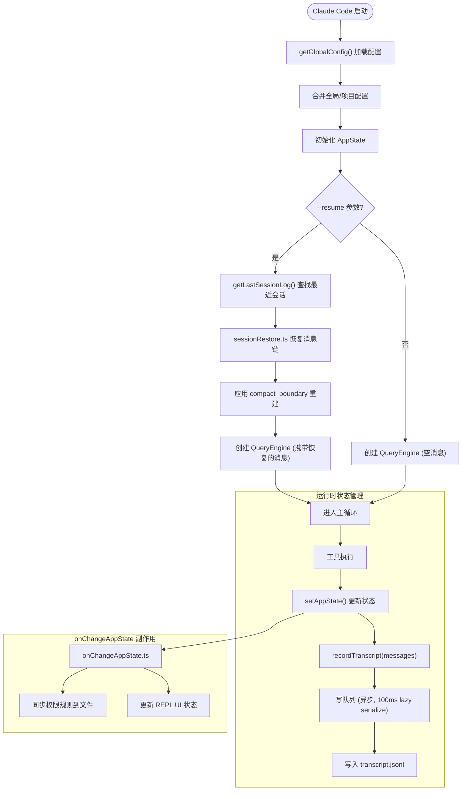

# 07 - State 全局状态与会话管理

> 源码位置: `src/state/` (6个文件, 含 AppState.tsx 23KB, AppStateStore.ts 21KB) + `src/utils/sessionStorage.ts` (180KB) + `src/utils/config.ts` (63KB) + `src/history.ts` (14KB) + `src/context.ts` (6KB)

State 系统是原版 Claude Code 的**全局状态机与会话持久化引擎**。它管理从运行时 UI 状态到跨 session 的对话历史恢复（`--resume`），以及用户配置的分层读取与合并。

---

## 1. 数据流图

```mermaid
graph TD
    subgraph 状态核心 (src/state/)
        Store["AppStateStore (Zustand-like)"] --> AS["AppState 状态树"]
        AS --> TPC["toolPermissionContext 权限状态"]
        AS --> FM["fastMode 状态"]
        AS --> FH["fileHistory 文件历史"]
        AS --> Attr["attribution 归因追踪"]
        AS --> Tasks["tasks 后台任务注册表"]
        AS --> Hooks["hooks 钩子状态"]
    end

    subgraph 配置管理 (src/utils/config.ts 63KB)
        GlobalCfg["~/.claude/settings.json"] --> Merge["getGlobalConfig()"]
        ProjectCfg[".claude/settings.json"] --> Merge
        EnvVars["环境变量覆盖"] --> Merge
        Merge --> Config["最终配置对象"]
    end

    subgraph 会话存储 (src/utils/sessionStorage.ts 180KB)
        AS -- "recordTranscript()" --> SS["SessionStorage"]
        SS --> Disk["~/.claude/sessions/<id>/transcript.jsonl"]
        Disk -- "--resume" --> Restore["sessionRestore.ts 恢复"]
        Restore --> AS
    end

    subgraph 会话历史 (src/history.ts)
        Disk --> Hist["listSessionsImpl() 列出历史"]
        Hist --> Resume["resume 恢复对话"]
    end

    Config --> AS
```

---

## 2. 入口与出口函数

### 2.1 入口: `AppState` — 全局状态树

```typescript
// 文件: src/state/AppState.tsx:1 (简化)
export type AppState = {
  // 工具权限上下文
  toolPermissionContext: ToolPermissionContext
  // 快速模式状态
  fastMode: FastModeState
  // 文件操作历史 (用于 undo/rewind)
  fileHistory: FileHistoryState
  // 代码归因追踪 (commit attribution)
  attribution: AttributionState
  // 后台任务注册表
  tasks: Map<string, TaskEntry>
  // Hook 执行状态
  hookState: HookState
  // ... 更多状态字段
}
```

### 2.2 核心入口: `getAppState()` / `setAppState()` — 状态读写

```typescript
// 由 QueryEngine 注入的函数引用
getAppState: () => AppState
setAppState: (f: (prev: AppState) => AppState) => void
```

状态更新采用 **不可变更新模式**（immutable update pattern）：
```typescript
setAppState(prev => ({
  ...prev,
  fileHistory: updater(prev.fileHistory),
}))
```

### 2.3 出口: `recordTranscript()` — 会话持久化

```typescript
// 文件: src/utils/sessionStorage.ts
export async function recordTranscript(messages: Message[]): Promise<void>
export async function flushSessionStorage(): Promise<void>
export function getLastSessionLog(): SessionLog | null
```

**SessionStorage 关键机制:**

| 函数 | 说明 |
|------|------|
| `recordTranscript()` | 增量写入 transcript.jsonl (写队列 + 100ms lazy JSON 序列化) |
| `flushSessionStorage()` | 强制刷新所有待写入数据 |
| `getLastSessionLog()` | 获取最近一次会话日志 (用于 --resume) |
| `listSessionsImpl()` | 列出所有历史会话 |

---

## 3. 结构流程图 — 状态生命周期



---

## 4. 结构流程图 — 配置加载与合并

```mermaid
flowchart TD
    Start(["getGlobalConfig()"]) --> ReadGlobal["读取 ~/.claude/settings.json"]
    ReadGlobal --> ReadProject["读取 .claude/settings.json"]
    ReadProject --> ReadEnv["检查环境变量覆盖"]

    ReadEnv --> Merge["合并配置"]

    subgraph 配置优先级 (高→低)
        CLI_OPT["CLI 参数"] --> ENV_OVERRIDE["环境变量"]
        ENV_OVERRIDE --> PROJECT_CFG["项目级配置"]
        PROJECT_CFG --> USER_CFG["用户级配置"]
        USER_CFG --> DEFAULT_CFG["内置默认值"]
    end

    Merge --> Validate["校验配置合法性"]
    Validate --> Cache["缓存配置对象 (memoize)"]
    Cache --> Return(["返回 Config"])
```

---

## 5. 核心设计原理

### 5.1 SessionStorage 写入性能优化 (180KB)
这是原版最大的单一文件（180KB），核心优化包括：
- **写队列**: 所有 `recordTranscript()` 调用通过 `enqueueWrite()` 排入队列，保证顺序写入
- **100ms Lazy JSON 序列化**: 消息对象的 JSON 序列化延迟到写入时才执行（`lazy jsonStringify`）。这利用了 `message_delta` 事件会就地修改最后一条 assistant message 的 usage/stop_reason 的特性——延迟序列化确保写入的是最终状态
- **Fire-and-forget**: assistant 消息的写入不 await（不阻塞 yield），而 compact_boundary 等关键消息则 await 确保落盘
- **增量 JSONL**: 每条消息追加为一行 JSON，而非重写整个文件

### 5.2 不可变状态更新模式
`AppState` 是 `DeepImmutable` 类型，所有更新必须通过 `setAppState(prev => {...prev, field: newValue})` 进行。这借鉴了 React/Redux 的模式：
- 引用比较 (`===`) 可快速判断是否有变更
- `onChangeAppState.ts` 作为副作用处理器，在状态变更时触发 UI 刷新、配置同步等

### 5.3 Session 恢复机制 (`--resume`)
原版的 `--resume` 功能支持从任意中断点恢复对话：
1. `getLastSessionLog()` 从 `~/.claude/sessions/` 中找到最近的 session
2. `sessionRestore.ts` 读取 `transcript.jsonl` 并重建消息链
3. 处理 `compact_boundary` 消息：通过 `preservedSegment` 中的 `headUuid/tailUuid` 精确重建压缩后的上下文
4. 重新创建 `QueryEngine`，携带恢复的 `initialMessages`

### 5.4 配置层级体系
原版支持 5 级配置优先级（从高到低）：

| 级别 | 来源 | 示例 |
|------|------|------|
| 1 | CLI 参数 | `--model claude-3-opus` |
| 2 | 环境变量 | `ANTHROPIC_MODEL=claude-3-opus` |
| 3 | 项目配置 | `.claude/settings.json` |
| 4 | 用户配置 | `~/.claude/settings.json` |
| 5 | 内置默认 | 代码中的默认值 |

关键配置项包括：
- `autoCompactEnabled` (boolean): 是否启用自动压缩
- `model` (string): 默认模型
- `theme` (string): 主题名称
- `permissions` (object): 工具权限规则
- `mcpServers` (object): MCP 服务端配置
