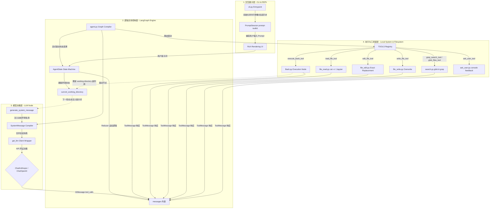
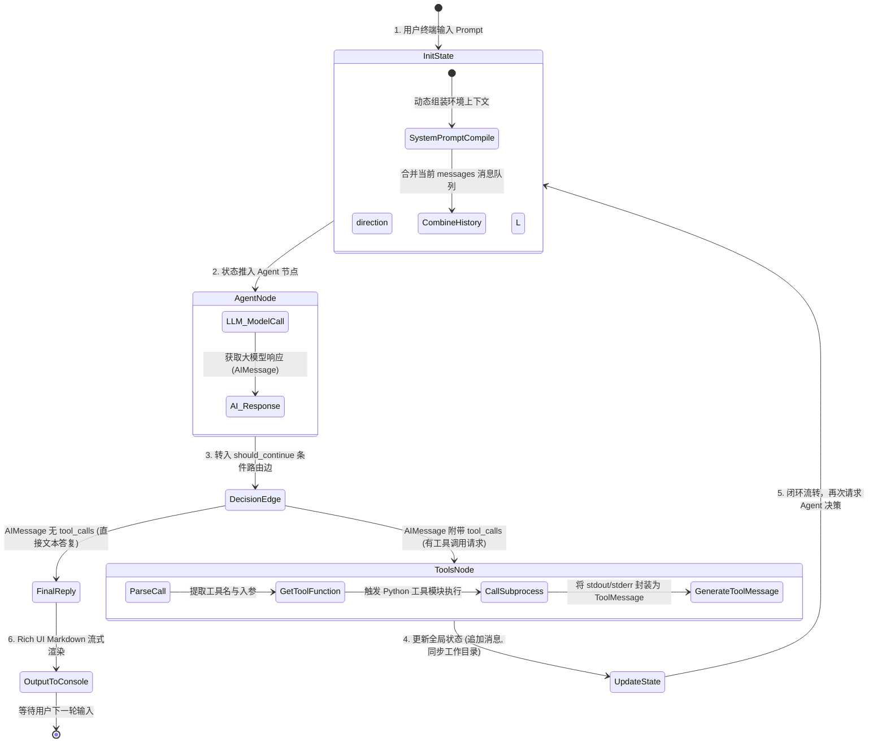
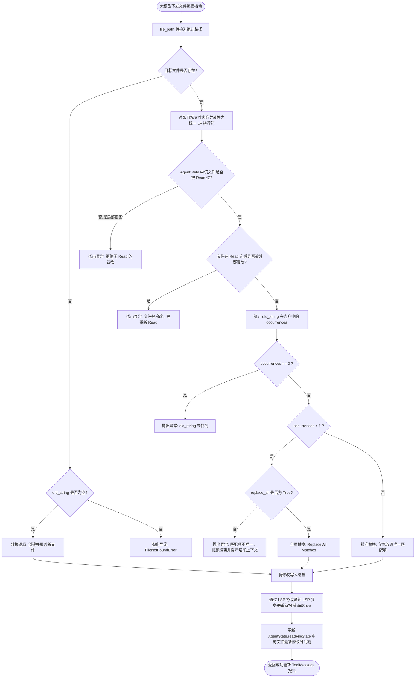
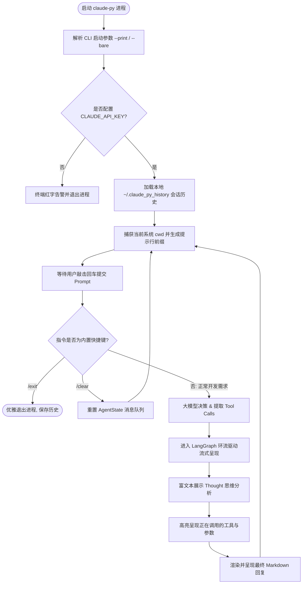

# Antigravity CLI (Claude Code Python 重构版) 深度架构设计报告

本设计报告旨在详尽阐述 **Antigravity CLI**（Python + LangGraph 版 Claude Code）的模块关系、核心控制循环、路径追踪机制与精准编辑替换算法。报告中使用大量 **Mermaid 图表**，多维度拆解系统架构、算法流转与数据闭环，以便开发人员与架构师能够直观地进行理解与后续迭代。

---

## 1. 系统模块分层拓扑架构

系统采用清晰的四层架构设计，实现了 **交互展示层、逻辑流转控制层、模型调用层与本地文件系统执行层** 之间的完全解耦与数据管道通信：



---

## 2. LangGraph Agent 循环控制流 (Agent Loop)

系统的核心心跳基于 LangGraph 进行图状态编译与驱动。以下展示了每一个推理与执行 Turn 中，节点（Nodes）和条件边（Conditional Edges）的跳转拓扑与流转判定算法：



---

## 3. CWD 目录切换算法时序图 (BashTool CWD Injection)

传统无状态子进程在执行 `cd` 指令后，后续的命令会跳回原目录。我们设计了一套 **工作目录拦截与 CWD 动态反射机制**，通过在 Shell 执行指令尾部注入“边界分隔符”与 `pwd` 命令，实现完美的状态跟踪：

```mermaid
sequenceDiagram
    autonumber
    participant CLI as cli.py 终端会话
    participant AGT as agent.py (LangGraph 引擎)
    participant BSH as bash.py 执行器
    participant SUB as subprocess (Shell 子进程)

    CLI->>AGT: 用户输入: "cd src && git branch"
    Note over AGT: 读取当前状态 CWD (e.g. /home/user)
    AGT->>BSH: execute_bash("cd src && git branch", cwd="/home/user")
    
    Note over BSH: 在命令尾部进行边界注入裹包:<br/>({ cd src && git branch ; } ; EXIT_CODE=$? ;<br/>echo '___CWD_MARKER___' ; pwd ; exit $EXIT_CODE)
    
    BSH->>SUB: 派生 Shell 子进程，设置工作路径为 "/home/user"
    SUB->>SUB: 1. 执行用户指令 cd src && git branch<br/>2. 打印用户指令 stdout/stderr
    SUB->>SUB: 3. 打印边界分隔符: ___CWD_MARKER___
    SUB->>SUB: 4. 执行 pwd 打印最新目录: /home/user/src
    SUB-->>BSH: 返回完整的拼接字符与 EXIT_CODE
    
    Note over BSH: 解析边界字符：<br/>1. parts[0] -> 原始指令输出<br/>2. parts[1] -> 最新的绝对路径 "/home/user/src"
    
    BSH-->>AGT: 返回 { stdout, stderr, exit_code, new_cwd="/home/user/src" }
    Note over AGT: 更新 AgentState 字段:<br/>current_working_directory = "/home/user/src"
    AGT-->>CLI: 在控制台上渲染工具执行完成，下一轮指令默认进入新 CWD
```

---

## 4. 文件原子精准替换算法 (FileEdit unique replacement)

`FileEditTool` 用于在不重写全量代码（节省 Token）的情况下对局部代码进行替换。为了杜绝大模型在代码库中有多次匹配项时产生误改，系统内置了**唯一性深度校验算法**：



---

## 5. 交互终端会话处理流程 (REPL CLI Loop)

CLI 会话层通过 `prompt-toolkit` 的会话保持机制以及 `rich` 渲染管道，提供完美的异步高拟真终端控制：


