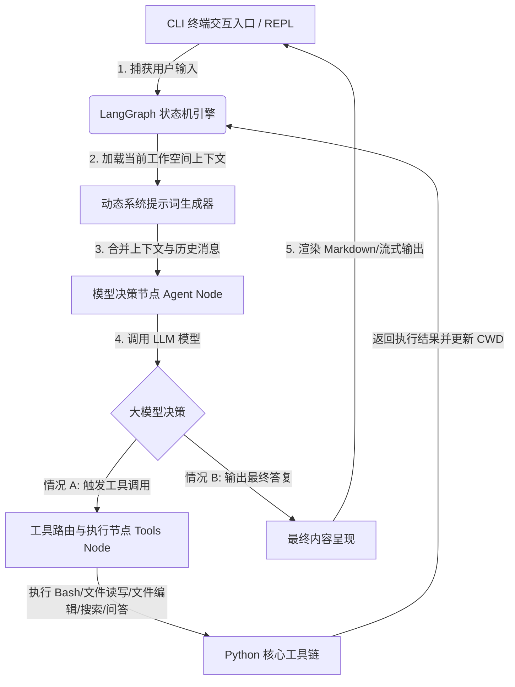

# Antigravity CLI (Claude Code Python 版) 架构报告

本项目是用 **Python + LangGraph** 对 Claude Code 核心能力的重构实现。本报告对整个系统的设计、核心状态流转、工具链执行以及 REPL/CLI 交互机制进行了深度的拆解分析。

---

## 1. 整体架构与拓扑图

系统采用 **“状态机 Agent 循环”** 作为核心设计模式。所有的操作、推理和工具调用都是围绕一个全局的 `AgentState` 进行流转的。以下是整体架构拓扑图：

---

## 2. 核心组件拆解

### 2.1 状态管理 (`claude_code/state.py`)
整个 Agent 运行期间的核心大脑是 `AgentState`，它是一个基于 TypedDict 的全局状态机。
*   `messages`: 跟踪和记录全链路的消息历史（包含 `HumanMessage`、`AIMessage` 和 `ToolMessage`）。利用定制的 `merge_messages` 减速器（reducer）在状态分支合并时对消息列表进行安全追加。
*   `current_working_directory`: 实时保存当前的终端工作目录。这对于实现像 `cd` 这种对目录位置有状态依赖的 bash 执行极其关键。
*   `plan`: 存储当前开发任务的局部规划或 TODO，保证复杂长链条任务的稳定可控。

### 2.2 动态系统提示词 (`claude_code/agent.py`)
为了使 Agent 能够像优秀的初级开发人员一样了解系统的边界，我们每次在进入决策节点前，都会动态捕获环境参数并组装成最新的 `SystemMessage`：
*   **时间上下文**: 提供当前的精确到秒的时间，让 LLM 能够感知时间跨度和操作时序。
*   **系统环境**: 探测当前的操作系统（如 macOS）和 CPU 架构。
*   **Git 仓状态**: 通过 `subprocess` 触发 `git rev-parse` 和 `git status --short`，抓取当前的活动分支和未提交文件的简短列表，注入到提示词中。
*   **工作空间定位**: 告诉 LLM 当前处于哪个真实绝对目录下。

### 2.3 工具执行模型 (`claude_code/tools/`)
我们自主封装了一套健壮的本地文件与执行工具：

#### 1. 命令行执行工具 (`BashTool`)
*   **挑战**: 传统的 stateless 进程执行执行完 `cd` 之后就会丢失当前工作目录。
*   **解决方案**: 我们使用了一种高妙的 `___CWD_MARKER___` 边界分隔符技术。在把命令下发给 `subprocess.run` 时，自动包裹成：
    `({ command ; } ; EXIT_CODE=$? ; echo '___CWD_MARKER___' ; pwd ; exit $EXIT_CODE)`
    这样不管命令成功还是失败，最终在 `stdout` 的最后一行，都会准确打印出最终所处的 CWD 和真实的退出状态码。我们对此进行解析并实时更新状态中的 `current_working_directory`。

#### 2. 精准替换编辑工具 (`FileEditTool`)
*   **挑战**: 直接重写文件不仅极其消耗 token，而且可能破坏无关的格式或代码。
*   **解决方案**: 实现高度可信的 `old_string` -> `new_string` 替换逻辑。在更新前进行严格的唯一性验证：
    - 若 `old_string` 在文件中未找到，抛出异常并提示 Agent。
    - 若 `old_string` 在文件中有多次重复，除非显式设置 `replace_all=True`，否则拒绝操作，提示 Agent 提供更丰富的上下文进行精确定位，杜绝误改。

#### 3. 结构化文件读取工具 (`FileReadTool`)
*   支持 `start_line` 和 `end_line` 参数以按需进行偏置限额读取，保护上下文窗口。
*   支持对 Jupyter Notebooks (`.ipynb`) 文件进行原生 JSON 结构化解析，将其转成可读性极强的文本格式并渲染执行输出。

---

## 3. LangGraph 逻辑控制流程

LangGraph 是我们控制推理环流的基础骨架，定义了以下两个关键组件：
1.  **`agent` 节点**: 调用绑定的 LLM 模型。在此节点中，模型会查看消息并决定是输出最终文本还是生成 tool 调用的结构化 schema。
2.  **`tools` 节点**: 一个拦截节点，解析 `AIMessage` 中的所有 `tool_calls`。根据工具名映射到我们的 Python 模块并进行执行。如果执行的是 `execute_bash_tool`，它还会提取输出中的 `[new working directory]` 并更新 `state["current_working_directory"]`。
3.  **`should_continue` 条件边**: 检查最后的 `AIMessage` 是否附带 `tool_calls`。如果附带，则路由到 `tools` 节点；如果不附带，则跳转至 `__end__` 终结，将控制权交还给 CLI REPL 交互环流。

---

## 4. CLI REPL 交互环流

在 interactive 状态下，`claude_code/cli.py` 扮演了人机交互枢纽的角色：
*   **会话保持**: 借助于 `prompt-toolkit`，不仅支持友好的输入提示行、终端色彩，还能通过 `~/.claude_py_history` 记录在本地的历史命令。
*   **实时流式呈现**: 我们设计了极其精致的 UI 反馈机制。借助 `rich` 库提供的组件，实时向用户展示 Agent 的当前行为：
    *   显示 Agent 的行为意图（例如 `Antigravity is analyzing...`）。
    *   突出展示正在调用的工具名以及具体的参数。
    *   以高度优雅的 Markdown 格式渲染 Agent 的最终回复，提升阅读体验。
