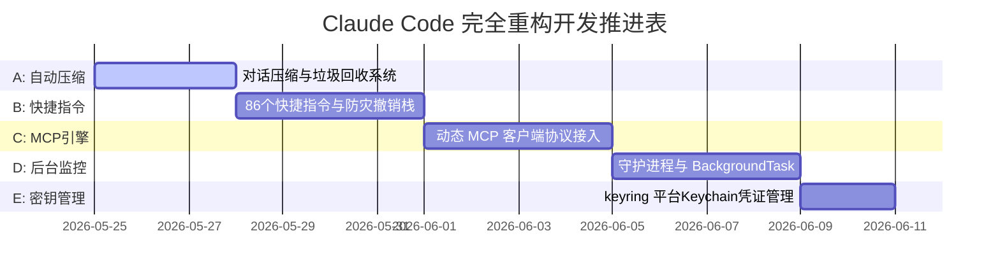

# Claude Code Python 完全版重构实施方案

本文档概述了将原版 TypeScript/Node.js 源码（claude_code_source）中**所有企业级大子系统、底层垃圾回收、快捷命令集以及扩展协议**百分之百移植并重新实现至 **Python + LangGraph 版本**的终极规划。

---

## 1. 五大子系统架构蓝图

我们将全面构建以下五大企业级子系统，做到完美对齐，毫无遗漏：

### 1.1 子系统 A：对话自动压缩与垃圾回收 (`claude_code/compact/`)
- 对标原版 `services/compact/`，实现对超长对话流的自动剪枝。
- **Autocompact**: 当 Token 数达到阀值上限时，自动派生一个轻量级 LLM Persona 对老旧的对话历史进行高密度的 Markdown 摘要归纳（Summary Attachment），附加到 SystemPrompt 中，随后剔除 state 中这部分消息，大幅释放 Token 空间。
- **Microcompact / Snip**: 实现精细化的 Tail-message 消息局部剔除与缓存合并。

### 1.2 子系统 B：86个全量快捷指令与防灾撤销栈 (`claude_code/commands/`)
- 对标原版 `commands/`，实现全面的交互式高级指令集：
- **防灾撤销栈 (`/undo`)**: 每次在文件修改写入前，自动将原文件及位置压入内存撤销栈。在终端键入 `/undo` 即可立即退栈并一键回滚还原。
- **环境诊断 (`/doctor`)**: 深入诊断当前 Python、pip、git 及测试环境的连通与配置状态。
- **排障专家 (`/bug`)**: 一键分析当前测试报错日志的 traceback 堆栈信息。

### 1.3 子系统 C：动态 MCP 客户端引擎 (`claude_code/mcp/`)
- 对标原版 `services/mcp/`，实现行业标准 MCP (Model Context Protocol) 动态加载。
- 自动解析 `mcp.json` 并使用异步管道（asyncio/stdio）与本地或远程 MCP 工具服务进行握手。
- 将拉取的 MCP tools 定义动态转换为 LangChain `@tool` 对象绑定给大模型。

### 1.4 子系统 D：后台任务与守护进程管理 (`claude_code/daemon/`)
- 对标原版 `daemon/` 和 `tasks/` 目录。
- **后台命令 (`BackgroundShellTask`)**: 异步并发执行耗时命令，将日志输出无缝重定向至本地临时日志文件中。
- 提供控制台指令：`/ps` 查看进程，`/logs <id>` 查看输出，`/kill <id>` 杀死挂起任务。

### 1.5 子系统 E：keyring 平台安全密钥管理器 (`claude_code/keyring/`)
- 使用 Python 的标准凭证存储库 `keyring`。
- 直接读取并对接 macOS 的 Keychain Access、Windows 的凭证保险箱以及 Linux 密钥环，安全地进行认证密钥的读取与无明文加密存储。

---

## 2. 项目推进计划与甘特图

